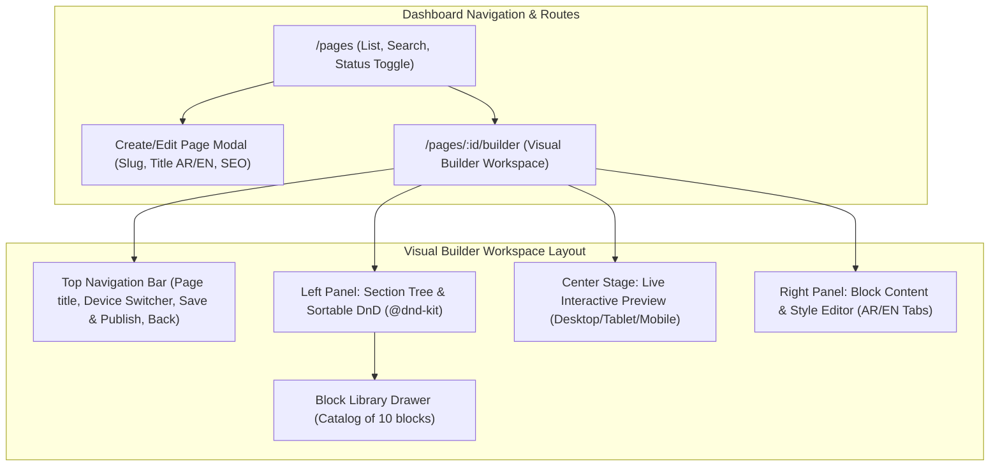

# Dynamic Page Builder Dashboard Implementation Plan

This plan details how we will build the Page Builder inside **`elwaseet_dash`** first, using high-fidelity mock data and real drag-and-drop interactions matching all 10 website block types from **`elwaset`**.

---

## 1. Dashboard Architecture & Component Hierarchy

---

## 2. Block Catalog & Localized Field Schemas

| Block Type | Component Name | Localized Fields (Arabic & English) | Settings & Media |
| :--- | :--- | :--- | :--- |
| **`home_banner`** | Home Hero Slider | Slide items with `name`, `description`, `link`, `products` tags | `autoplay`, `effect` (fade/slide), `speed` |
| **`who_us_summary`** | About Section | `badge`, `title`, `description`, `button_text`, `button_link` | `image`, `layout` (image left/right) |
| **`collection_cards`** | Discover Collection | `section_title`, cards array (`title`, `desc`, `link`) | Card images, columns count |
| **`recent_products`** | Recent Products | `section_title`, `description`, `cta_button_text` | `category_id`, `limit`, `sort_by` |
| **`why_choose_us`** | Why Choose Us | `section_title`, `description`, features list (`title`, `desc`) | `icon` (SVG / icon identifier) |
| **`our_story`** | Our Story | `main_title`, `main_text`, bullet items (`title`, `text`) | Story images gallery, bullet icons |
| **`statistics_counter`**| Statistics / Milestones | Stats items (`label`, `value`) | `background_image`, `overlay_opacity` |
| **`faq_accordion`** | FAQ Accordion | `section_title`, `description`, FAQ list (`question`, `answer`) | `default_open_first`, `category_filter` |
| **`contact_section`** | Contact & Info | `title`, `subtitle`, contact items (`email`, `phone`, `address`) | `show_form`, `side_image`, `social_links` |
| **`rich_text_sections`** | Policies & Legal | Subsections list (`key` / heading, `value` / rich content) | `padding_y`, `max_width` |

---

## 3. Implementation Steps

### Step 1: Types & Mock Data Store (`src/types/pageBuilder.ts` & `src/mocks/pageBuilderMock.ts`)
- Define strict TypeScript models for `Page`, `PageSection`, `BlockType`, and specific block contents.
- Implement mock data service with default pre-populated pages (`home`, `who-us`, `contact-us`, `faq`, `terms`) backed by `localStorage` (falls back to memory), enabling immediate persistence, additions, reordering, editing, and reset-to-defaults.

### Step 2: Pages List Route (`src/routes/Pages/show-all.tsx`)
- Table view displaying: Title (localized), Slug, Page Type (system/landing/policy), Sections Count, Status (Published/Draft toggle), Last Updated, and Actions.
- Quick actions: "Open Builder", "Edit Metadata & SEO", "Preview Page", "Duplicate", "Delete".
- Search and status filter tabs.

### Step 3: Visual Page Builder Workspace (`src/routes/Pages/builder.tsx`)
- **Top Header**: Breadcrumb, Page status badge, Viewport selector (Desktop / Tablet / Mobile), "Add Block" button, Save changes indicator.
- **Left Panel (Layers & Hierarchy)**:
  - Drag-and-drop sortable section list powered by `@dnd-kit`.
  - Section actions: Duplicate, Toggle Visibility, Delete, Click to Select for editing.
- **Add Block Library Modal**:
  - Visual cards with icons and descriptions for all 10 block types.
- **Center Canvas (Live Preview)**:
  - Responsive container rendering high-fidelity previews of the blocks in real time.
- **Right Panel (Block Inspector)**:
  - Tabbed interface (`العربية` / `English` / `Settings`).
  - Dynamic form fields matching the selected block type (text inputs, textareas, image uploaders, item lists with add/remove).

### Step 4: Routing & Drawer Integration
- Add routes in `src/routes/routeList.ts`:
  - `/pages` (Pages list)
  - `/pages/:id/builder` (Visual builder)
- Add "Page Builder" (`إدارة الصفحات`) navigation item with icon in `src/components/Drawer/Drawer.tsx` under Content / Management section.

### Step 5: Backend API Documentation File (`public/page_builder_api.md`)
- Complete Markdown documentation with exact JSON request & response structures for all 10 block types.